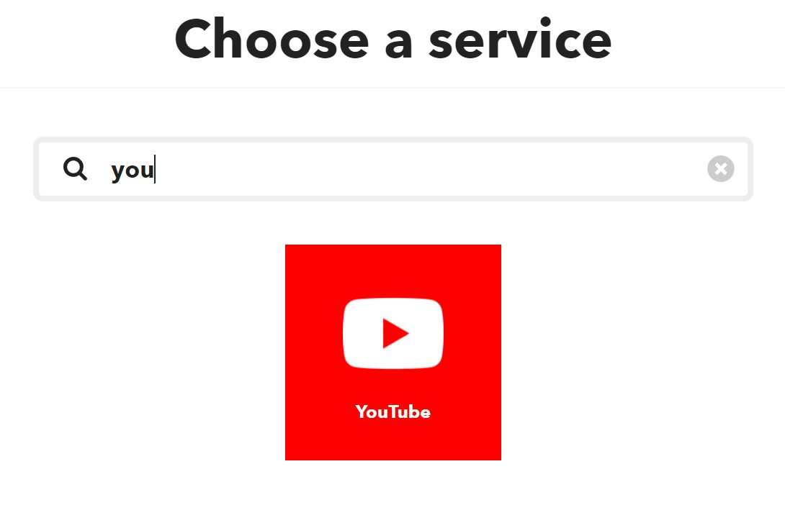
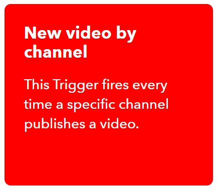
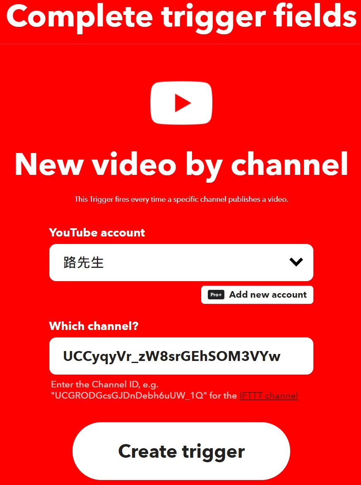
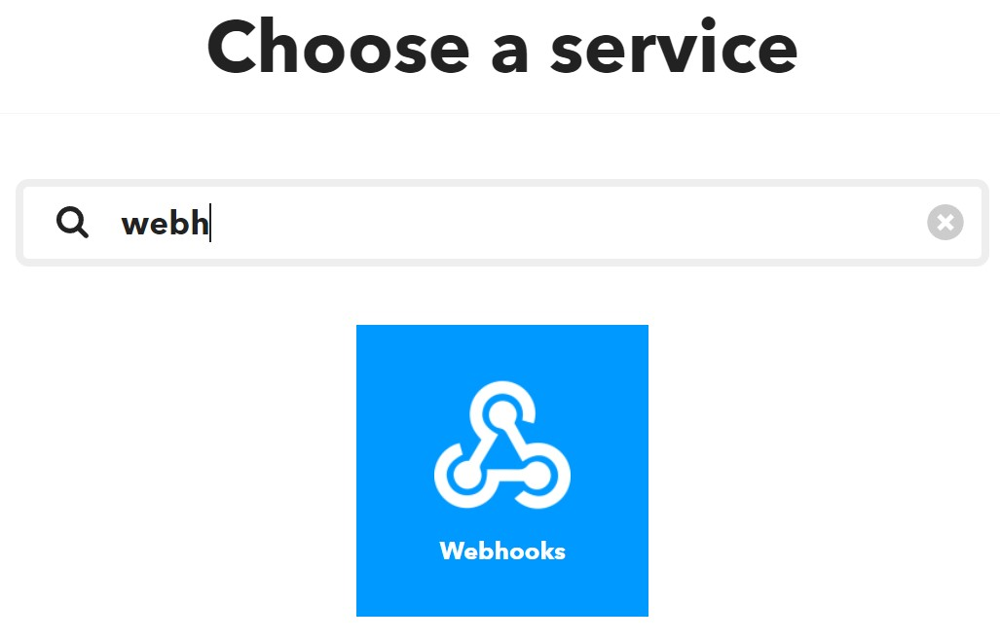
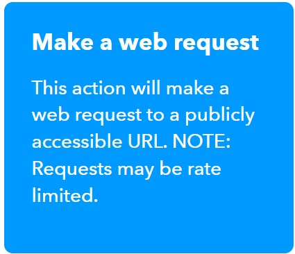
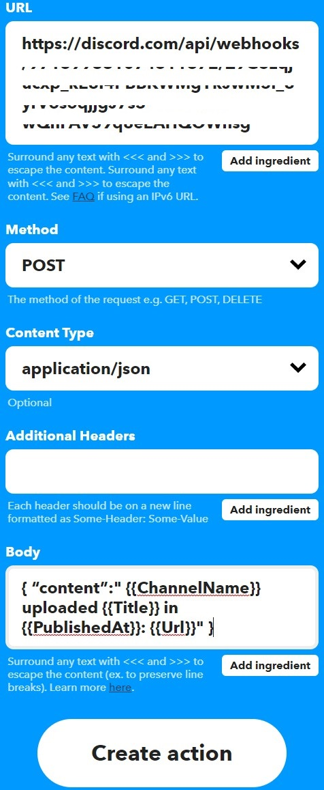

+++
author = "Hugo Authors"
title = "Disocrd自動轉貼YT最新影片 (IFTTT)"
date = "2022-05-12"
description = "最新影片、排定直播，都會在DC頻道內通知。"
tags = [
    "Discord",
    "Youtube",
    "自動轉貼",
] #標籤
categories = [
    "Discord",
] #分類
series = ["Themes Guide"]
aliases = ["migrate-from-jekyl"]
image = ""
+++
<!-- Global site tag (gtag.js) - Google Analytics -->

## 在Discord創建Webhook並命名。
選擇想要發送訊息的特定頻道。  

## 註冊IFTTT  https://ifttt.com/home

## 創建Applet  https://ifttt.com/create
#### 點擊"IF This"，輸入關鍵字搜尋Youtube/Twitter。
  
#### 選擇你要的發送條件。依據條件的不同，會有不同需要設定的選項或授權。
  
#### 登入Youtube帳號，並貼上想要轉貼的頻道帳號。
 
#### 點擊"Then That"，輸入關鍵字搜尋Webhooks。
  
    
#### 選擇Make a web request
 
#### 在"URL"，輸入"步驟1-Webhook的網址"。
##### 在"Method"，選擇"POST"。
##### 在"Content Type"，選擇"application/json"。
##### 在"Body"，輸入Youtube/Twitter/RSS對應指令。
 

Youtube
轉發特定頻道 ↓↓  
{ "content":" {{ChannelName}} uploaded {{Title}} in {{PublishedAt}}: {{Url}}" }  
  
Twitter ↓↓  
{ "content":"@{{UserName}} {{CreatedAt}}: {{LinkToTweet}}" }  
  
 
#### (8) 點擊"Create Action"。
#### (9) 點擊"Continue"。
#### (10) 點擊"Finish"完成。