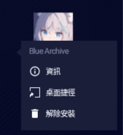
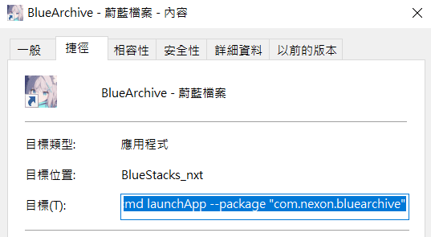
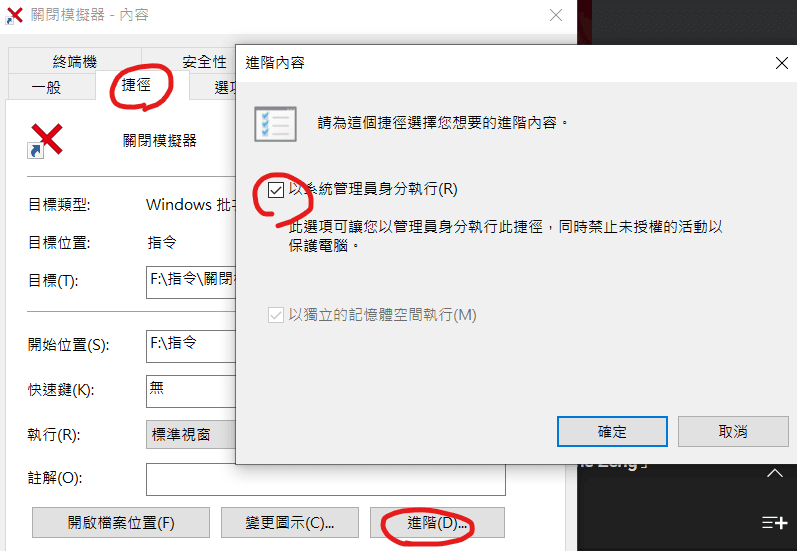

+++
author = "Hugo Authors"
title = "模擬器一鍵多開"
date = "2022-03-05"
description = "跳過多開管理器的勾選，設定固定開啟組合"
tags = [
    "多開",
    "指令",
    "設定",
] #標籤
categories = [
    "模擬器",
] #分類
series = ["Themes Guide"]
aliases = ["migrate-from-jekyl"]
image = "00010.JPG"
+++
<!-- Global site tag (gtag.js) - Google Analytics -->
<script async src="https://www.googletagmanager.com/gtag/js?id=G-FNDM35MCGM"></script>
<script>
  window.dataLayer = window.dataLayer || [];
  function gtag(){dataLayer.push(arguments);}
  gtag('js', new Date());

  gtag('config', 'G-FNDM35MCGM');
</script>
瀏覽人數<span id="busuanzi_value_page_pv"></span>  


# 一鍵多開 (BS5)

*示範一鍵三開，2開啟蔚藍檔案，1開楓之谷M*

## 長按App，建立桌面捷徑↓↓


------------


## 點選桌面的捷徑右鍵 → 內容 → 複製目標的內容↓↓


------------


## 新增文字文件 → 輸入下列指令↓↓
```bash
start ""
timeout /t 2 /nobreak >nul
```


------------


## 貼上剛剛複製的目標內容↓↓
```bash
start "" "C:\Program Files\BlueStacks_nxt\HD-Player.exe" --instance Nougat64  --cmd launchApp --package "com.nexon.bluearchive"
timeout /t 2 /nobreak >nul
```

------------


## 重複動作三次，指令應和下方相同 (要幾開，就1~4重複幾次)↓↓
```bash
start "" "C:\Program Files\BlueStacks_nxt\HD-Player.exe" --instance Nougat64  --cmd launchApp --package "com.nexon.bluearchive"
timeout /t 2 /nobreak >nul
start "" "C:\Program Files\BlueStacks_nxt\HD-Player.exe" --instance Nougat64_2  --cmd launchApp --package "com.nexon.bluearchive"
timeout /t 2 /nobreak >nul
start "" "C:\Program Files\BlueStacks_nxt\HD-Player.exe" --instance Nougat64_3  --cmd launchApp --package "com.nexon.maplem.global"
timeout /t 2 /nobreak >nul ←最後一個模擬器則可以不用這一段
```　
------------
## 右鍵另存新檔，附檔名更改為.bat，完成。6.右鍵另存新檔，附檔名更改為.bat，完成。↓↓


```bash
start "" "C:\Program Files\BlueStacks_nxt\HD-Player.exe" --instance Nougat64_2  --cmd launchApp --package "com.nexon.bluearchive"
timeout /t 2 /nobreak >nul

```
##### 補充說明
模擬器本體位置C:\Program Files\BlueStacks_nxt\HD-Player.exe" --instance Nougat64_2
只想開模擬器不開遊戲可以將這串刪除  --cmd launchApp --package "com.nexon.bluearchive"
timeout /t 2 每個模擬器開啟的間隔2秒

------------


## 強制關閉全部模擬器
 1.新增文字文件  
 2.輸入下列指令  
 ```bash
 taskkill /f /im HD-Player.exe /im HD-Player.exe
 ```
 3.右鍵另存新檔，附檔名更改為.bat  
 (↑↑到這邊已完成，只是需要以管理者執行才會關閉模擬器)  
 4.點.bat右鍵 → 傳送到桌面建立捷徑  
 5.點捷徑右鍵 → 捷徑 → 進階 → 打勾 管理員身分執行 → 確定  
 6.完成  


------------


由於多款遊戲不時會在2~6開支間切換  
管理器在那邊勾來勾去  
若遠端操作有時粗手指還點不到選項
    
而 __全部關閉__ 這個功能常常有幾個卡住關不掉，滿崩潰的  
自己是把所有的.bat指令都丟在BS的資料夾內  
全部建立捷徑順便改icon丟到工作列上的工具列  


歡迎分享交流其他不同的方式
