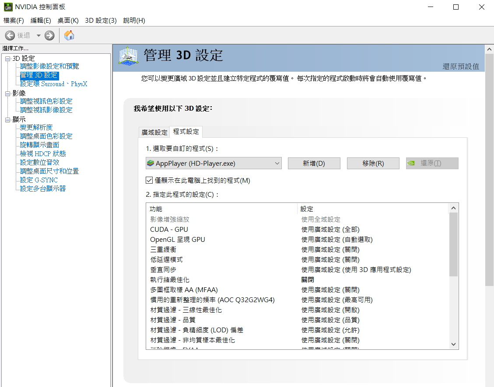
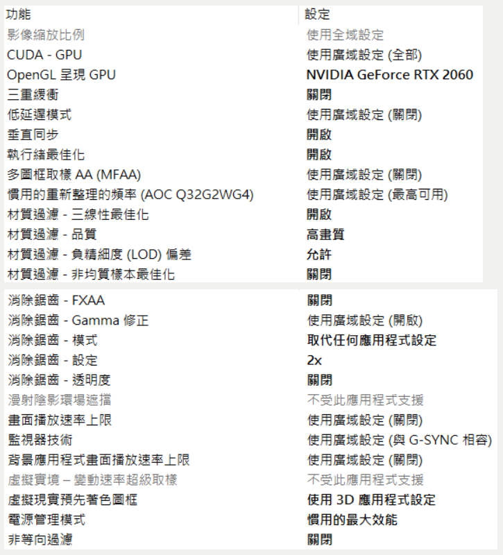
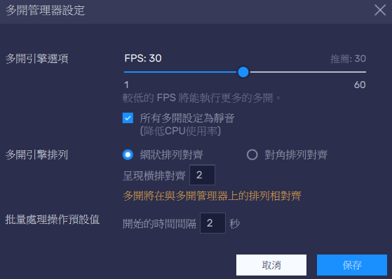

+++
author = "Hugo Authors"
title = "Nvdia控制面板、模擬器對應設定"
date = "2022-03-15"
description = "減少遊戲閃退狀況。"
tags = [
    "模擬器",
    "設定",
] #標籤
categories = [
    "模擬器",
] #分類
series = ["Themes Guide"]
aliases = ["migrate-from-jekyl"]
image = "002.png"
+++
<!-- Global site tag (gtag.js) - Google Analytics -->

本站總訪問量次
本站訪客數人次
本文總閱讀量次

## 開啟Nvdia控制面板

  
  
  
路徑 C:\Program Files\BlueStacks_nxt\HD-Player.exe  
可依照電腦狀況自行調整  
  
## 程式設定  

------------
## 模擬器設定

------------
## 多開管理器設定

------------
電腦配備：  
|組件   |型號       |備註      |  
| --------   | :----:  | :----:  |
|CPU    | 3900X     |   12c24t|  
|MB     | B550-i    |         |  
|RAM    | DDR4-3200 |   16G x2|  
|GPU    |RTX2060OC  |   ZOTAC |  
|POW    |SF-450     |         |  

